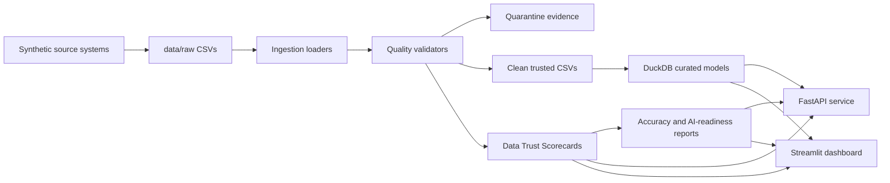

# AI-Ready Data Quality Command Center

## Project Overview

Large enterprises are investing in AI, GenAI agents, ML, automation, analytics, and real-time decision systems. These initiatives often fail because source data is stale, duplicated, incomplete, inconsistent, poorly governed, or not traceable.

This project simulates a Fortune 50-style enterprise data environment and builds a production-style local data platform that turns messy raw data into trusted, governed, AI-ready data products.

## What This Project Proves

For recruiters and hiring managers, this project demonstrates that I can:

- Translate an enterprise AI trust problem into a working data engineering system.
- Generate deterministic synthetic data with known quality defects.
- Build validation, quarantine, clean outputs, curated models, scorecards, APIs, dashboards, tests, Docker, and CI.
- Provide accuracy evidence by comparing injected defects with detected defects.
- Communicate technical work in business-readable terms.

## Architecture



## Core Business Question

Can this dataset be trusted for analytics, AI models, GenAI agents, or executive reporting?

## Python 3.12 Setup

This repo includes `.python-version` with Python `3.12`.

Recommended setup:

```bash
python3.12 -m venv .venv
source .venv/bin/activate
python -m pip install --upgrade pip
python -m pip install -r requirements.txt
```

If your default `python` points to Anaconda or Python 3.8, do not use that interpreter for this project. Check with:

```bash
python --version
```

If it reports Python 3.8 or an old Anaconda environment, create a Python 3.12 virtual environment and run commands from the activated `.venv`. The project targets Python 3.12 for reproducible local behavior and CI compatibility.

## Quickstart

Generate deterministic synthetic data:

```bash
python -m src.data_generation.generate_synthetic_data
```

Run the full pipeline:

```bash
python -m src.pipeline.run_all
```

Run tests:

```bash
python -m pytest
```

Run linting:

```bash
python -m ruff check .
```

## Expected Outputs

After generation and pipeline execution:

- `data/raw/injected_issue_manifest.json`
- `data/quarantine/quality_issues.csv`
- `data/quarantine/*_quarantine.csv`
- `data/clean/*.csv`
- `data/processed/command_center.duckdb`
- `data/scorecards/table_scorecards.csv`
- `data/scorecards/ai_readiness_summary.json`
- `data/scorecards/accuracy_report.csv`
- `data/scorecards/accuracy_report.json`

See [docs/sample-outputs.md](docs/sample-outputs.md) for representative scorecard rows, issue records, accuracy evidence, API response shape, and executive interpretation.

## Accuracy Evidence

The generator records every deliberately injected tracked issue in `data/raw/injected_issue_manifest.json`. The pipeline compares that manifest with validator output and creates deterministic accuracy reports:

- `data/scorecards/accuracy_report.csv`
- `data/scorecards/accuracy_report.json`

Tracked issue types include duplicate customers, missing customer emails, invalid account foreign keys, stale source loads, invalid product codes, transaction outliers, negative balances, unauthorized employee access, transactions linked to closed accounts, and schema drift.

Current V0.2 target: all tracked injected issues are detected with no missed tracked issues.

## API

Start the FastAPI app:

```bash
python -m uvicorn src.api.main:app --reload
```

Endpoints:

- `GET /health`
- `GET /tables`
- `GET /tables/{table_name}/score`
- `GET /issues`
- `GET /quarantine`
- `GET /ai-readiness-summary`

## Dashboard

Start the Streamlit dashboard:

```bash
python -m streamlit run src/dashboard/app.py
```

Dashboard sections:

- Executive Overview
- Table-Level Data Trust Scores
- Data Quality Issues
- Quarantine Records
- AI-Readiness Assessment
- Source Load Freshness
- Lineage Summary

## Testing

Run:

```bash
python -m pytest
python -m ruff check .
```

V0.2 target: at least 25 tests passing. The tests cover deterministic generation, manifest creation, each major validator category, quarantine outputs, score ranges, accuracy reports, DuckDB curated tables, API responses, and full pipeline execution.

## Docker

```bash
docker compose up --build
```

The API runs on port `8000` and the dashboard runs on port `8501`.

## Business Value

The project shows how data engineering teams can provide measurable trust signals before data reaches downstream AI or reporting systems. Instead of vague claims that data is “clean,” consumers can inspect issue evidence, quarantine records, trust scorecards, freshness summaries, lineage records, and detector accuracy.

## Screenshots

Screenshots are intentionally left as a portfolio publishing step:

- Executive dashboard screenshot placeholder
- Table scorecard screenshot placeholder
- Quality issue drilldown screenshot placeholder
- API response screenshot placeholder

## STAR Story

Situation: large enterprises are blocked from scaling AI because they lack trusted, governed, AI-ready datasets.

Task: design a data quality and AI-readiness command center that certifies datasets before analytics, ML, or GenAI usage.

Action: built synthetic source generation, validation, quarantine, scoring, DuckDB curated models, API, dashboard, tests, CI, Docker, and deterministic accuracy evidence.

Result: delivered a reproducible local platform with table-level trust scores, audit-ready evidence, and production-style engineering practices.

## Future Enhancements

- Add severity-weighted scoring formulas.
- Add Great Expectations suites as an optional validation backend.
- Add richer lineage graph visualizations.
- Add deterministic AI-generated issue summaries with local fallback.
- Add PostgreSQL deployment mode.
- Add screenshot assets for portfolio publishing.

## Project Status

V0.2: enterprise-grade portfolio hardening focused on reproducibility, accuracy evidence, stronger validation, broader tests, and business credibility.
